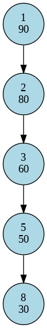
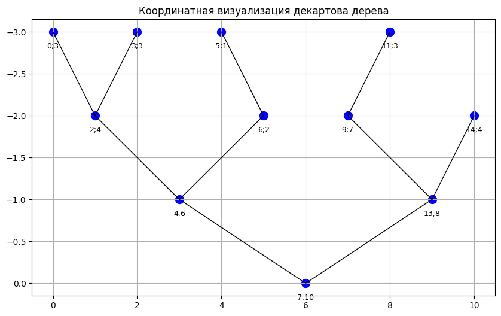
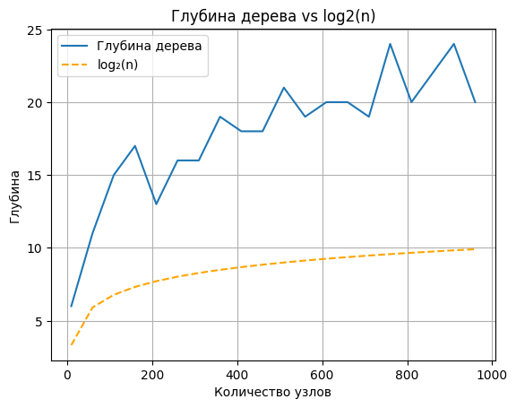

МИНИСТЕРСТВО НАУКИ И ВЫСШЕГО ОБРАЗОВАНИЯ РОССИЙСКОЙ ФЕДЕРАЦИИ
ФЕДЕРАЛЬНОЕ ГОСУДАРСТВЕННОЕ АВТОНОМНОЕ ОБРАЗОВАТЕЛЬНОЕ УЧРЕЖДЕНИЕ ВЫСШЕГО ОБРАЗОВАНИЯ «НАЦИОНАЛЬНЫЙ ИССЛЕДОВАТЕЛЬСКИЙ ТЕХНОЛОГИЧЕСКИЙ УНИВЕРСИТЕТ «МИСИС»
ИНСТИТУТ КОМПЬЮТЕРНЫХ НАУК (ИКН)

Курсовая работа на тему
## «Декартово дерево»

Выполнила: студентка группы БИВТ-23-1
Панютищева Екатерина Сергеевна

## Описание
Декартово дерево (Cartesian Tree) — структура данных, сочетающая свойства бинарного дерева поиска (BST) и кучи (heap). В данной курсовой работе реализована вставка, удаление, split/merge и визуализация дерева.

Работа включает:

- Подробное описание алгоритмов
- Реализацию на Python
- Визуализацию структуры дерева с помощью Graphviz
- Координатную визуализацию в matplotlib
- Графики глубины и анализа структуры

## Содержание
- `code/` — исходный код Python и Jupyter
- `img/` — изображения дерева и графики
- `report/` — (опционально) PDF с полным текстом курсовой

## Примеры визуализации
### Декартово дерево (Graphviz)

### Координатная визуализация

### Глубина дерева и логарифм

